# Multiclaude Diagrams

Visual diagrams for understanding multiclaude's architecture and data flows.

## System Overview

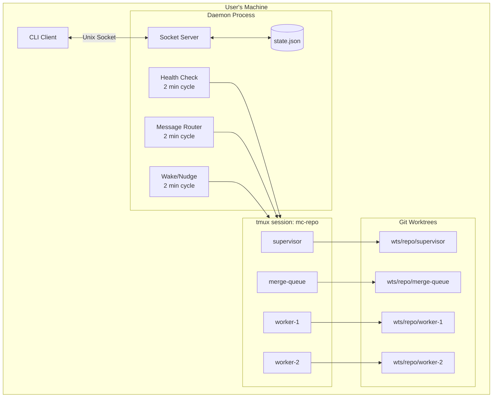

## The Brownian Ratchet

The core philosophy: chaos creates progress when filtered through CI.

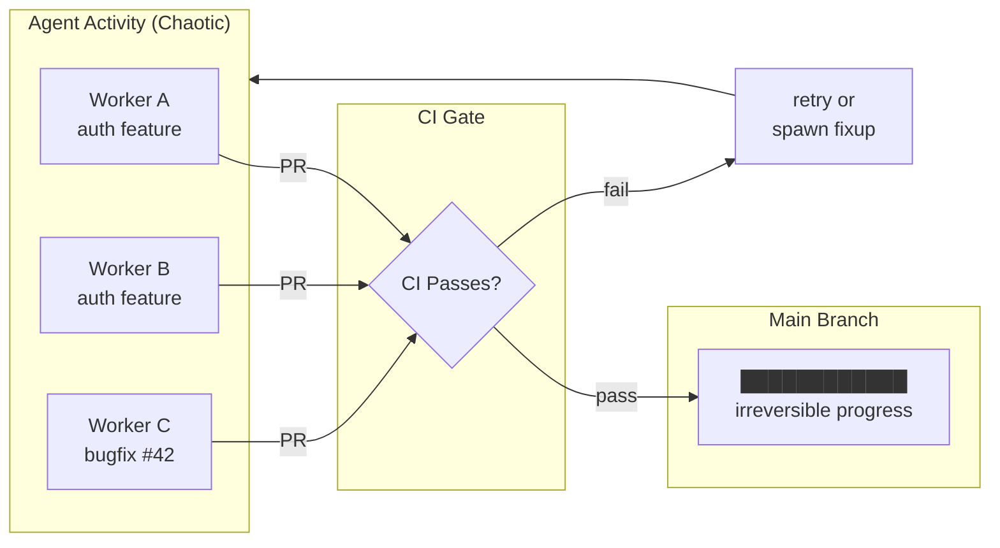

## Agent Types and Relationships

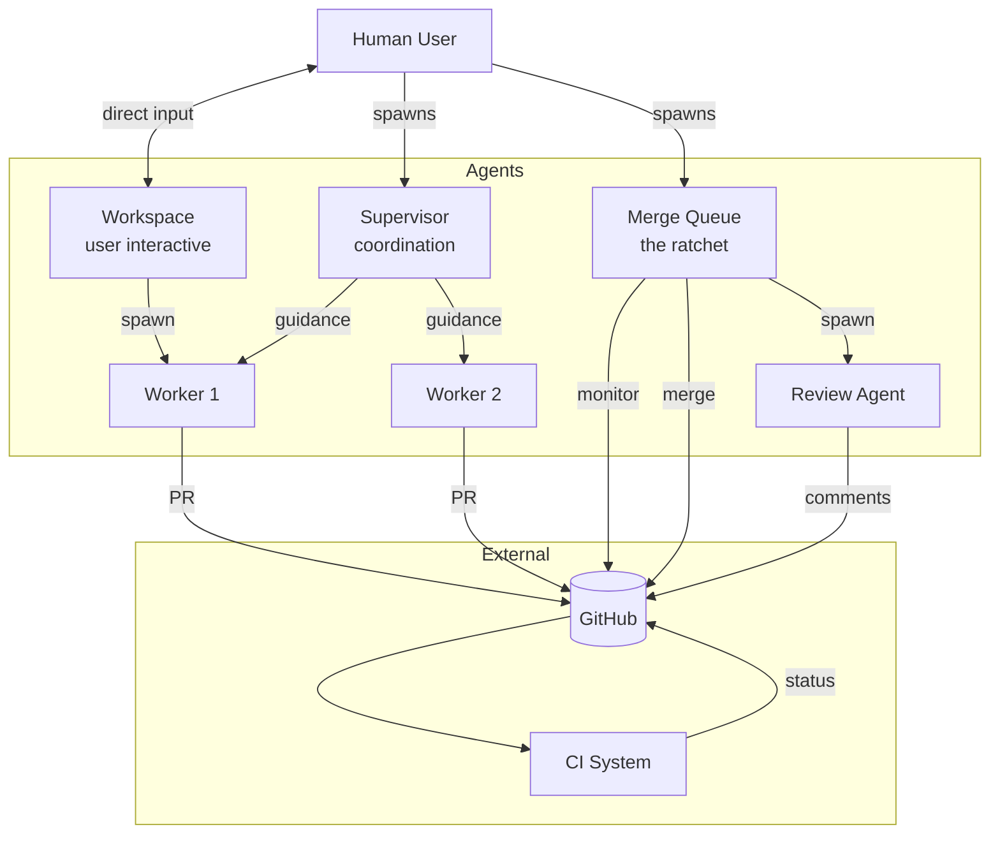

## Worker Lifecycle

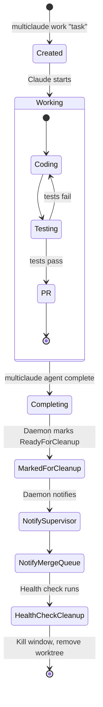

## Worker Creation Flow

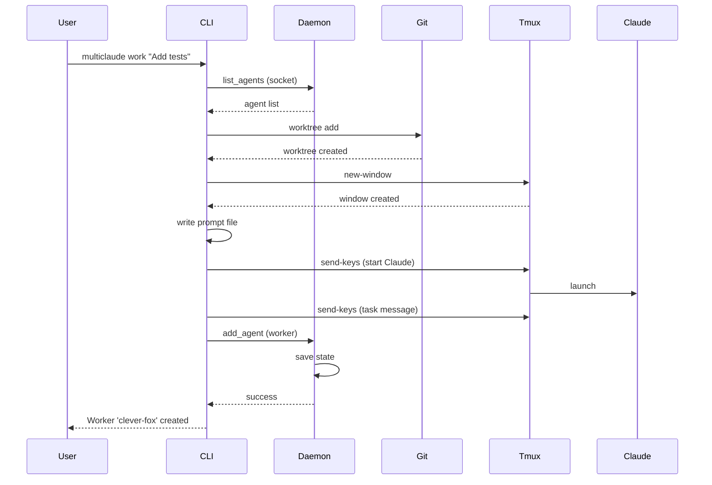

## Message Routing

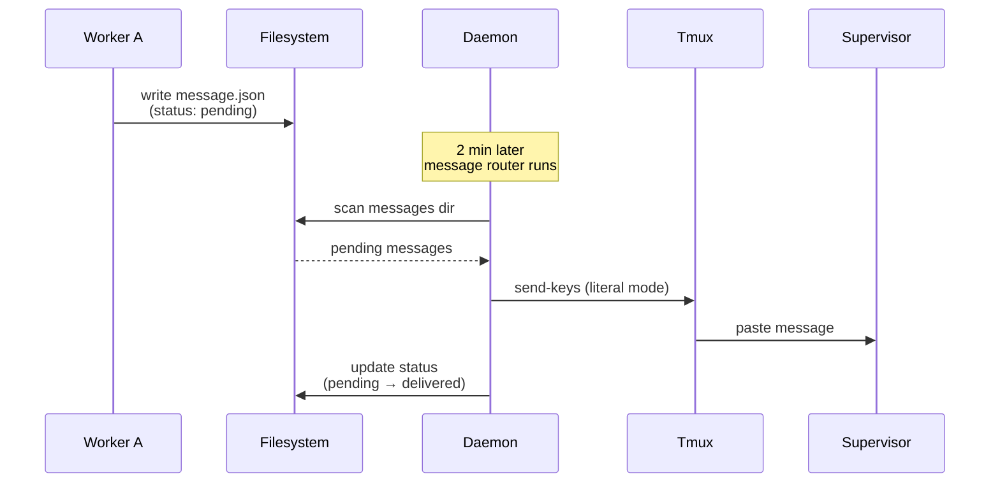

## Message Status Flow

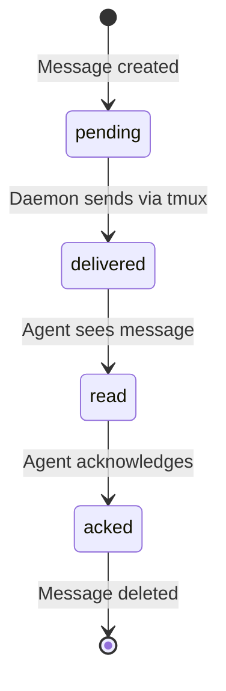

## Repository Initialization

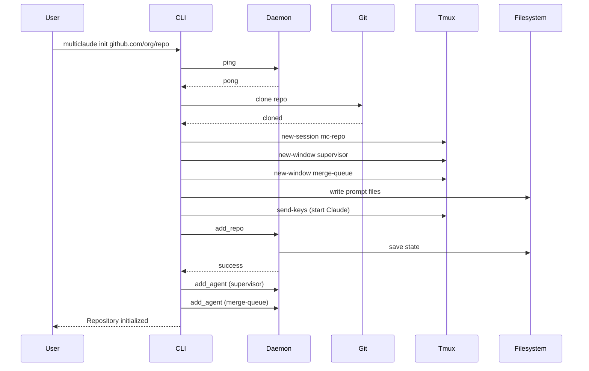

## Health Check Loop

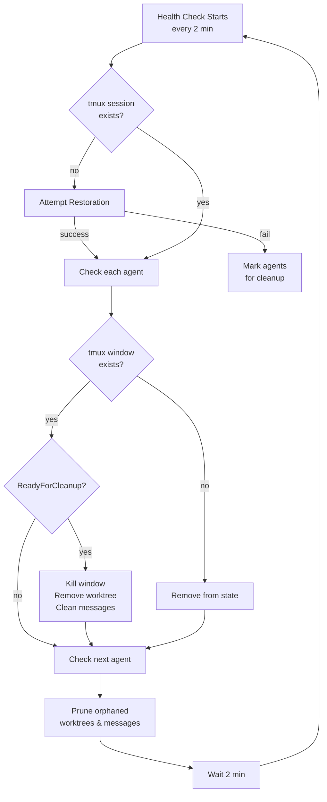

## Daemon Goroutines

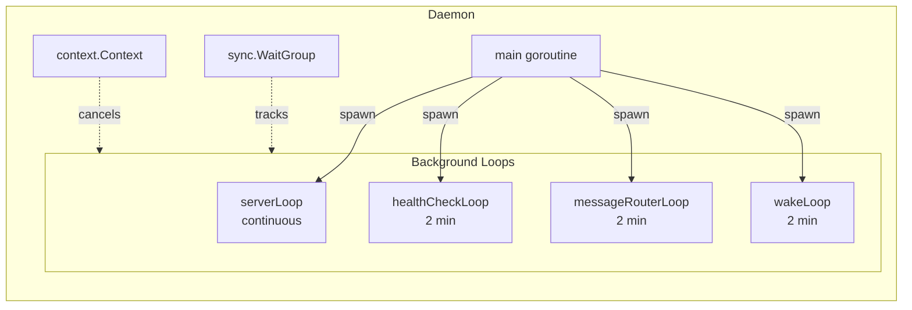

## File System Layout

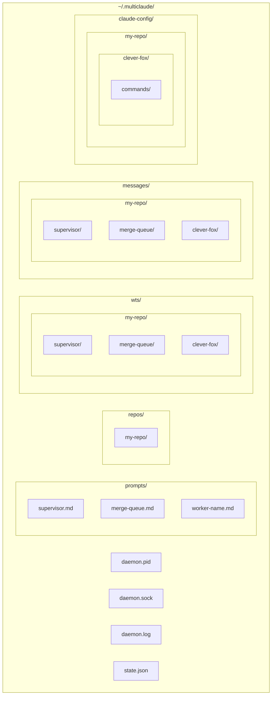

## Shutdown Sequence

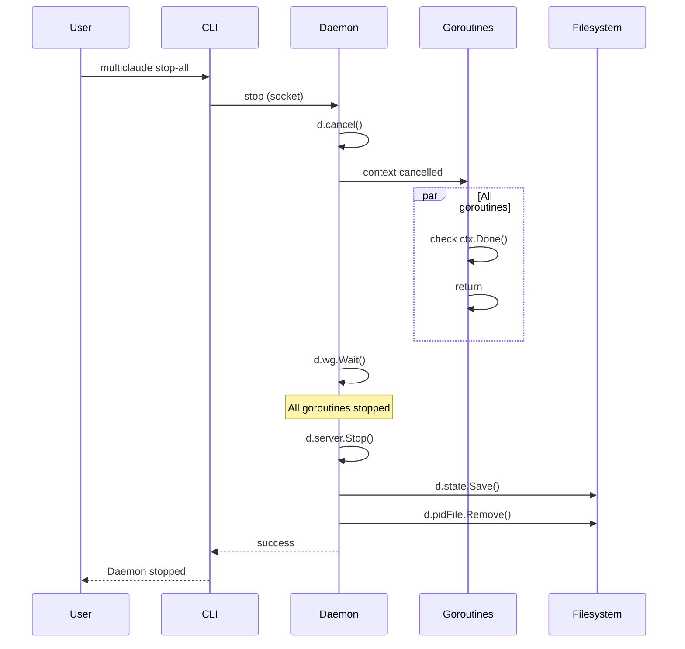

## State Thread Safety

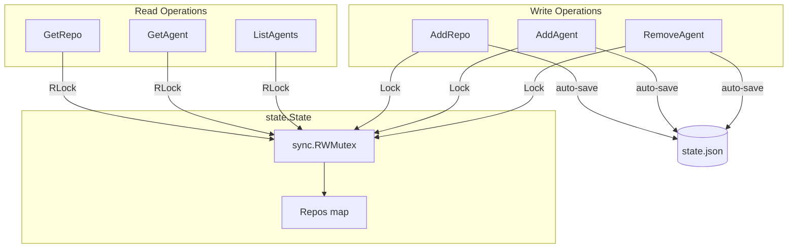
